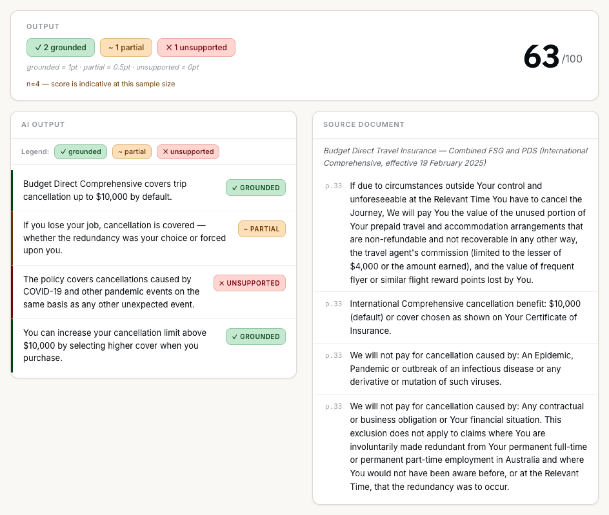

<!-- _class: lead -->
<!-- _paginate: false -->

# Does Your AI Know When It's Lying

 
Checking AI Claims Against Evidence

Ching Chew · August 2026

 

<!-- note:
Pre-show: deployed app open on the Budget Direct fixture, scorecard visible, help modal closed.

Open with the hook, don't put it on a slide:
"At the last few AI presentations I've been to, someone in Q&A always asks a version of the same question: we're told we can use AI, but we're still accountable for what it says. How do we do that without re-reading the 200-page report ourselves?"

Let the room sit with it for a second before moving to the next slide.
-->

---

## The Accountability Paradox

- You're told you can use AI
- You're still accountable for what it says
- The report is 200 pages and you have an afternoon
 

**How do you check the parts that matter without reading everything?**

<!-- note:
Don't answer it. Let it sit. Everyone in the room has hit this, whether they call it that or not.

For execs: this is the governance gap they're already worried about: staff using Copilot/Claude with no way to verify output.
For devs: this is the eval gap: "I built a RAG pipeline" isn't the same as "I measured whether it's right."

Humans are not 100% right. We also experience time pressure and review fatigue.

What could you do right now to automate? Agent self-review, subagent review, second model review etc.

I wanted something more robust with eval against ground truth/golden dataset.
-->

---

## Before / After

**Before:** a paragraph of AI-generated text. Plausible. Confident. No way to tell which parts are backed by the source.

**After:** the same output, claim by claim (grounded, partial or unsupported). Click any claim to see its evidence.

<!-- note:
Let the screenshot do most of the work. Don't over-narrate this one.
The "before" is any AI summary tool your audience already uses: Copilot, ChatGPT, an internal RAG bot.
-->

---

<!-- _class: break -->
<!-- _paginate: false -->

# Live Demo

Budget Direct PDS Fixture

<!-- note:
1. Open the fixture: Budget Direct Comprehensive Travel Insurance PDS
2. Show the scorecard: 63/100, 2 grounded, 1 partial, 1 unsupported
3. Click the unsupported claim: "COVID-19 cancellations covered on the same basis as any other unforeseen event"
4. Point out: no matching span, evidence note explains the pandemic-exclusion clause contradicts it
5. Click a grounded claim for contrast; quote highlights directly in the source pane
6. This is decompose → verify → localise, running live, not precomputed for the demo
-->

---

## How It Works

<strong>Entailment (NLI)</strong>: does the source text entail the claim, contradict it or say nothing about it? This is what the verifier scores, not "does this sound plausible."

No retrieval step narrows the document first: every claim is checked against the whole source.

<!-- note:
For execs: "it reads the whole document, not just the bit a search index thinks is relevant."
For devs: MiniCheck (flan-t5-large) scores each atomic claim against every chunk, max-pooled. No retrieval gate: the recall trade-off is explicit, not accidental.
Teams/ADO Wiki adaptation: this pattern doesn't touch a chat platform at all; it evaluates a document pair, so the "trigger" is whatever produced the AI output (a Copilot session export, an internal RAG bot's answer log, an email).
-->

---

## Key Technical Decisions

### Decompose-then-verify, not hierarchical RAG
- Retrieval fetches the best chunk; grounding has to check every claim against everything
- A missed retrieval hit reads as "unsupported" for the wrong reason

### MiniCheck (local, free) vs Claude Haiku (cloud, paid)
- Same interface, swappable at runtime, but not symmetric under the hood
- MiniCheck scores every chunk independently and keeps the best match, while Haiku sees all chunks in one prompt and answers once
- Validation run: $0 vs ~A$9 for n=300 documents

### Numeric-consistency as a deterministic pre-pass
- NLI can't do arithmetic: a transposed number can still look "entailed"
- Scoped to dollar figures specifically; doesn't cover percentages, dates or other counts
- Caught by a separate, deterministic check, not folded into the verifier

<!-- note:
For devs: decision 1 is the one worth defending in Q&A: "why not just use a vector DB?" The answer is recall, not laziness.
For devs: the MiniCheck/Haiku asymmetry matters if recall numbers get compared head-to-head in Q&A — Haiku's higher recall (0.90 vs 0.69) isn't purely a model-quality story, it's also a different consumption pattern (single-pass over concatenated context vs exhaustive per-chunk scoring).
For execs: decision 3 is the governance-relevant one: a known, named blind spot with a documented fix, not a silent gap. The numeric check itself has a named scope limit too: dollar figures only, for now.
-->

---

## What It Measures

| Mode | Cost | Recall | Agreement (κ) |
|---|---|---|---|
| MiniCheck (default) | Free | 0.69 | 0.195 |
| Claude Haiku | ~A$0.03/doc | 0.90 | 0.331 |

<strong>Cohen's kappa (κ)</strong>: agreement with human judgment, corrected for chance, not raw accuracy. 0.195 is "slight agreement," 0.331 is "fair agreement" on the standard scale.

<strong>RAGTruth</strong>: a published benchmark of labelled hallucinations in AI summaries (n=300 sampled here), not a number this project invented or self-labelled.

**With those numbers in hand, the reading burden shrinks from the whole document to the flagged claims.**

<!-- note:
This is the evidence behind the earlier claim that this beats "I read it and it seemed fine"; that alternative has no error rate at all, because nobody measured it.
For execs: recall (not kappa) is the number that matters operationally: a missed hallucination costs more than a false alarm here.
-->

---

## SOTA: Why Not Just Use X

- **UK AISI's Inspect harness**: Grounding Inspector ships as a custom Inspect `Scorer`; it extends Inspect rather than competing with it
- **Numeric transposition**: open, field-wide gap; reference architecture: Proof-Carrying Numbers (arXiv:2509.06902)
- **Entity/citation substitution**: same structural cause as the numeric gap; reference architecture: HalluGraph (arXiv:2512.01659)
- **Whole-of-government scale**: Dept of Finance's GovCMS DXP team runs the same decompose-then-verify shape (their "Scrutiny" pipeline) across the entire AU government content corpus; this is that pattern, shippable today, at solo-project scale
 

**Both gaps are named here, not hidden.**

<!-- note:
Anticipates the question before it's asked. If someone in Q&A knows Inspect, this earns credibility rather than looking unaware of it.
Entity/citation substitution: an NLI verifier tolerates a swapped name or citation if the sentence shape still matches; same failure mode as the numeric gap, different span type.
GovCMS DXP: "Government content is AI food," APS Digital Profession Innovation Month, July 2026. Their Verify stream benchmarks AI answers against an authoritative whole-of-gov corpus using a hierarchical multi-agent review pipeline, same shape as this tool's verifier, running at ~5c/doc on a $10k/month GovAI budget. Good "who else is already doing this" answer if asked.
-->

---

<!-- _class: break -->
<!-- _paginate: false -->

# Live Demo

The Numeric-Mismatch Catch

<!-- note:
Faster. Audience already understands the flow.
Show a claim where the stated dollar figure doesn't appear anywhere in the matched evidence.
Point out: this isn't the NLI verifier catching it; it's the separate deterministic numeric check, labelled honestly as an "automated numeric check" rationale, not dressed up as model reasoning.
-->

---

## Lessons Learnt

- κ=0.195 is an honest ceiling, not a marketing number
- MiniCheck doesn't do arithmetic: numeric-consistency is a bolt-on, not built in
- Entity/citation substitution is unsolved here too: same as the numeric gap, field-wide (see SOTA)
- Validated on RAGTruth's general-summarisation distribution, not measured on insurance/legal text
- Grounding checks what's said, not what's missing: omission errors are structurally invisible to this pattern
- The highlighted "evidence" is a best-guess keyword match, not proof of what the verifier actually used

<!-- note:
"I'm showing you a pattern and being straight about where it ends."
For execs: this is what a defensible governance story looks like: known limits, named, with a documented fix path, not a claim of perfection.
Omission: NOHARM (arXiv:2512.01241, Stanford/Harvard ARISE Network) found errors of omission account for more than 80% of severe errors across 31 LLMs on medical consultation tasks, not commission. A fact-check-against-source pass can only ever evaluate claims present in the output; it has no mechanism to flag "the model should have said X but didn't." Same paradigm limit applies here, not just in medicine. Name this before Q&A raises it as a gotcha.
Localise disconnect: the verdict (grounded/partial/unsupported) and the highlighted span are computed independently. The verifier scores chunks for entailment; the localiser separately picks the section with the most shared keywords. For MiniCheck the verifier does know its best-scoring chunk internally, but that information is discarded before it reaches the localiser. For Haiku there's no per-chunk score to discard in the first place — it reads all chunks in one pass. So a claim can be correctly grounded against section A while the UI highlights section B. State this plainly if a technical audience member asks how the evidence highlight is derived — it's a keyword-overlap heuristic, not a trace of the verifier's reasoning. Fix path logged in FUTURE.md: threading MiniCheck's real argmax chunk through is a contained change; Haiku has no equivalent signal to reuse and needs its own design call (self-reported span vs re-architecting to per-chunk scoring).
-->

---

## The Bigger Pattern

The same decompose-then-verify shape applies to:

- Regulatory submissions (TGA AusPARs, similar disclosure corpora)
- Legislative and policy text
- Contract and compliance review

<!-- note:
"So what" moment for executives: any long-document-plus-AI-output pairing in your own department fits this shape.
Seed the question: where in your team's workflow does an AI already summarise something someone else has to sign off on?
Legislative and policy text isn't hypothetical: Dept of Finance's GovCMS DXP team is already building this whole-of-government (search.gov.au alpha), including a verification pipeline for the same reason. If asked "is anyone doing this at scale," that's the answer.
-->

---

## Conclusion

"The first principle is that you must not fool yourself, and you are the easiest person to fool."
__Richard Feynman__
 

- Grounding Inspector tells you if an AI claim is supported by your document
- Uses RAGTruth (hallucination benchmark) and NLI
- Improves with better verifier (i.e. models) but still has gaps (e.g. entity/citation substitution, omission errors)

 

Thank you for your time
Feedback and comments: DM me via Teams or LinkedIn
[github.com/cchew/grounding-inspector](https://github.com/cchew/grounding-inspector)

<!-- note:
The Feynman line is doing the real work of this talk: the whole build is an argument against fooling yourself about output quality.
-->

---

<!-- _class: appendix -->
<!-- _paginate: false -->

## Appendix A: Audit Readiness

Three additions before a scorecard is defensible in an APS governance context (AI Impact Assessment, ANAO audit, Ministerial inquiry):

- **Version pinning**: log the engine version, MiniCheck model version and source document hash into every scorecard. Without it, a scorecard isn't reproducible.
- **Pre-stated pass/fail threshold**: a `min_grounded_pct` field, set before the test run. Post-hoc thresholds aren't defensible in an audit.
- **Scope declaration**: every report states plainly that unsupported claims have not been verified as false, only unverified against the given source.

<!-- note:
Cover only if time permits or directly asked: this is the SES/EL2 audience's slide, not the core dev talk.

The IMDA Model AI Governance Framework for Agentic AI (Jan 2026) names explainability and auditability as governance requirements. Decompose-then-verify satisfies both by construction: small, auditable verification units and an interpretable verifier judgment. This wasn't built to the framework; it happens to fit because it's what defensible engineering looks like anyway. Full paragraph in the blog post if asked for a citable source.
-->

---

<!-- _class: appendix -->
<!-- _paginate: false -->

## Appendix B: Verifier Benchmarking Detail

| Metric | MiniCheck | Claude Haiku |
|---|---|---|
| Recall | 0.69 (CI 0.59-0.78) | 0.90 (CI 0.82-0.95) |
| Cohen's κ | 0.195 | 0.331 |
| Balanced accuracy | 0.612 | n/a |
| False negatives | 31 / 100 positives | n/a |
| Decomposer | Ollama qwen2.5:7b-instruct | Claude Haiku 4.5 |
| Cost | Free, local | ~A$0.03/doc |

Both validated on RAGTruth, n=300, seed=0.

<!-- note:
Recall is the metric this tool prioritises: a missed hallucination (false negative) is costlier than a false alarm for this tool's intended use.
Balanced accuracy and false-negative counts are reported for MiniCheck only in the current benchmark run.
Provenance: MiniCheck's numbers are stamped into all five fixture scorecards with a pipeline commit hash (1814f83) and are reproducible from the repo. Claude Haiku's numbers came from a real pilot_claude.py run, but its output directory is gitignored and no longer exists locally, so the exact figures aren't independently re-derivable from what's checked in. Only mention this if asked to reproduce the Haiku number specifically.
-->

---

<!-- _class: appendix -->
<!-- _paginate: false -->

## Appendix C: Other Ways to Catch What Grounding Misses

- **Self-review** (same model checks its own output): NOHARM found repeating the same model doesn't meaningfully reduce harm
- **Cross-model review** (a different vendor's model checks the output): NOHARM found diverse multi-model ensembles reduce harm by ~8 percentage points over solo models; only strong "finisher" models drove the gain, not any combination
- **Prompt refinement**: a different lever entirely; improves what the model says, not whether an independent check catches what it got wrong

<!-- note:
Cover only if asked "what about self-review / a second model / better prompting instead of a separate verifier."
Source: NOHARM (arXiv:2512.01241), Stanford/Harvard ARISE Network, bench.arise-ai.org. Same-model-twice ≈ self-consistency, not independent verification, and the data agrees: it doesn't help much. This is the argument for this tool's separate-verifier-model design, not against it: cross-model checking works, self-checking doesn't, and this tool goes one step further by using a purpose-built entailment verifier rather than a second general chat model.
Prompt refinement isn't a competing verification strategy: it's upstream (better elicitation), this tool is downstream (independent check). Don't let the room conflate the two.
-->
